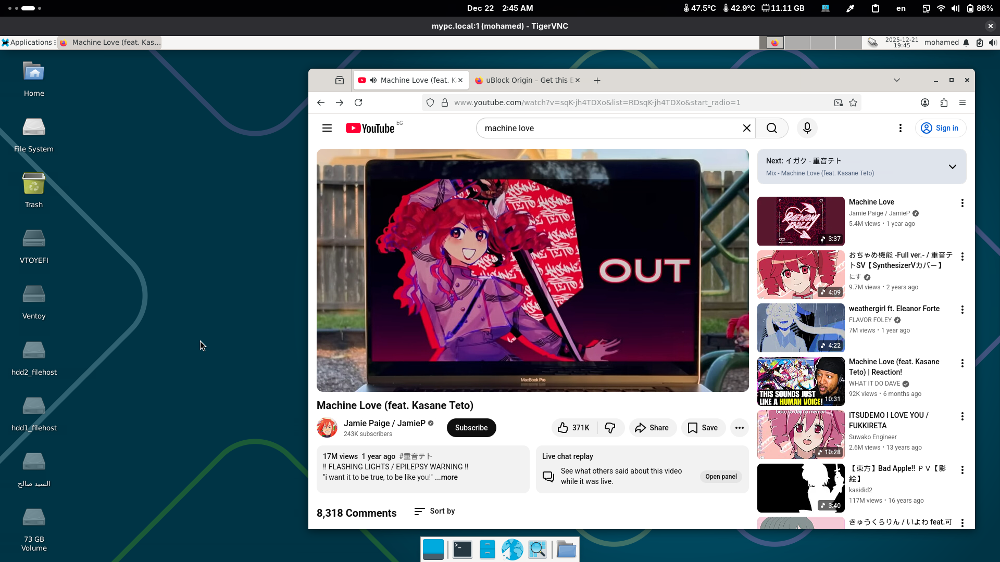
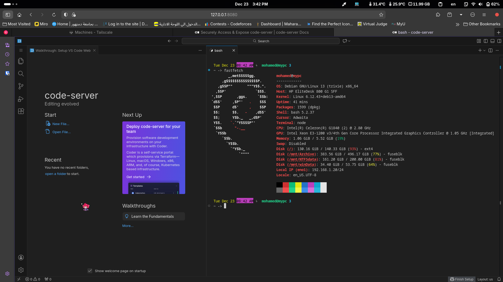
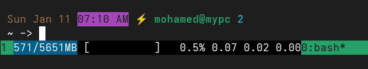
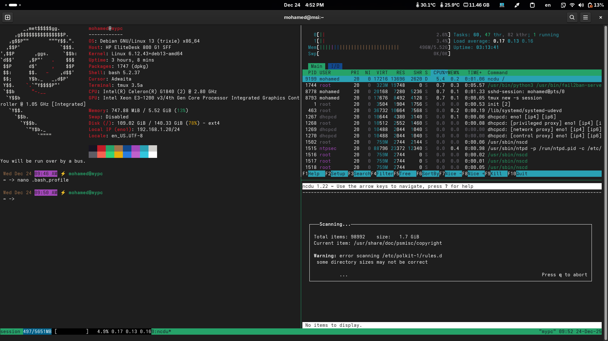

# My Home Lap!
I used my 12-years-old x86 pc as a server in my room! and here I am documenting everything related to it. I will leave a refrence for any thing you may can not understand!

my server is not accessible over the internet, the ISP in Egypt is using [CGNAT](https://en.wikipedia.org/wiki/Carrier-grade_NAT), so I need to pay for a static ip, about 30EGP (0.55USD), but the internet service is old and slow, 10mbps Download and 1.2mbps upload, still using copper wired till today and limited expensive Quota, 140GB/mo with 30mbps maxspeed for 240EGP (about 5 USD).

I focused on:
- power efficincy.
- ZERO money, everything exists already.
- the highest possible performance.
- not too much hard and not too much ready-to-use, I picked the hard road for the performance.
- make all display ports useless (use it with out attached screen as possible as I can).

### fast access:
- [hardware.](#hardware)
    - [specs](#server-specs)
    - [network.](#router-zxhn-h108n-v25-2015)
- [software.](#software)
- [preparing.](#setting-up)
- [features.](#list-of-things-i-got-and-source-to-get-start)
- [Future plans](#what-i-want-to-add)
- [Refrences](#refrenses)

## Hardware
### Server Specs:

- Model: [HP EliteDesk 800 G1 SFF](https://www.hardware-corner.net/desktop-models/HP-EliteDesk-800-G1-SFF/)
- CPU: [Intel(R) Celeron(R) G1840 (2) @ 2.80 GHz](https://www.intel.com/content/www/us/en/products/sku/80800/intel-celeron-processor-g1840-2m-cache-2-80-ghz/specifications.html).
    - 2 [core](https://en.wikipedia.org/wiki/Multi-core_processor), 2 [thread](https://en.wikipedia.org/wiki/Thread_(computing)).
- Generation: [HASWELL](https://en.wikipedia.org/wiki/Haswell_(microarchitecture))
- Power Supply: 270W, if I am not wrong.
- Memory: 6GB
    - 3 slots of 2GB ddr3 with about 1300mhz or something like that.
- GPU: Intel Xeon E3-1200 v3/4th Gen Core Processor Integrated Graphics Controller @ 1.05 GHz [Integrated]
    - aka: intel HD integrated GPU
- Storage:
    - WDC [WD5000AAKX](https://www.newegg.com/Western-Digital-Blue-WD5000AAKX-500GB/p/N82E16822136769?recaptcha=pass) (WD blue 500GB 7200RPM) 2015 
    - WDC [WD6400AARS](https://www.newegg.com/western-digital-wd-green-wd6400aars-640gb/p/N82E16822136737) (WD Green 640GB 5400RPM - 12% health) 2010 :( I am using it as a read-only archive for useless stuff, it is dangerouse to keep important data on it.
- cheap old [ZTE router](https://www.amazon.eg/-/en/Zte-H108n-Adsl2-Wireless-Router/dp/B091J99485) for 150EGP (10USD ig).
- cheap CAT6 LAN cable, two meters, for 20EGP (0.4USD).

This is a very old pc made for simple bussines, very cheap and used, I bought it without any disks and 4gb of ram in 2020 or 2021 for 600EGP (40USD) in that time.

My dad got the old 640GB HDD many years ago when we was using a Pentium Dual Core TawerPC with 1GB of ram, so we changed it in 2023 with another used HDD, the 500GB blue one, it was about 200EGP (7USD) in that time, this HDD in his half life time, but works fine ig.

also I had a 2gb slot of ram from my previouse PC, it was ddr2 and I replaced it, with no charge lol.

### Router: ZXHN H108N V2.5 2015
I have edited some settings to get the max possible speed in local network, you can access the admin panel from `192.168.1.1` using `admin`, `admin` as credintials, here it is:
- Network > WLAN 	 	
    - Mode: mixed(802.11b,802.11g,802.11n)
    - Band Width: 40Mhz
    - Channel: 13	
    - SGI Enable: yes	
    - Beacon Interval 100 ms
    - Transmitting Power: 80%	
    - QoS Type: WMM
    - RTS Threshold: 2300 	
    - DTIM Interval: 1
- Netwrok > LAN > DHCP Binding
    - here I acossiated a static IP (192.168.1.20) for my PC MAC address.
- Security > Firewall > Firewall level: low
- also DNS is `1.1.1.1` and `8.8.8.8`

you can use any Ai tool like Gemini or whatever to guide you if you are lazy to search for each property.

Speed in SFTP is about 5MB/s to 10MB/s and this is enough for me.

## Software
- [OS](https://en.wikipedia.org/wiki/Operating_system): [Debian](https://en.wikipedia.org/wiki/Debian) GNU/Linux 13 (trixie) x86_64
- [Kernel](https://en.wikipedia.org/wiki/Kernel_%28operating_system%29): [Linux](https://en.wikipedia.org/wiki/Linux) 6.12.43+deb13-amd64
- [Packages](https://en.wikipedia.org/wiki/List_of_software_package_management_systems): 1653 ([dpkg](https://en.wikipedia.org/wiki/Deb_(file_format)))
- 3GB [ZRAM](https://en.wikipedia.org/wiki/Zram) ([zstd](https://en.wikipedia.org/wiki/Zstd) algorithm)
- NO [SYSTEMD](https://en.wikipedia.org/wiki/Systemd)! I nuked it and using [sysvinit](https://en.wikipedia.org/wiki/Init#SYSV) (The OG).

### what is systemd and sysvinit?
these peices of software is used to manage services, start the system and preparing userspace in youe linux os

### why I nuked systemd?
systemd is a good piece of software and offer many benifits, but it becomes useless when it eat your resources, why to use this while you can use any other old simple way to manage your services and hardware?

### what any simple init system offers?
- faster boot time (since it is a simple script starts services).
- lower ram usage (because it is just a process handle other proccess or a proccess just start other proccess, like runit).
- much simpler in usage and doesn't have many features that you do not need.

### why it is not widly used?
- systemd aim to make everything the same in all linux distrobutions, this may make you happy since you wont suffer here and there, but will kill the varity, but stability and compatability is the priority now!
- systemd is now supported everywhere and most apps works out-of-box with it, not like other simple init systems, this is because of developers and time not init system fault or red hat is evil.
- provide more and more and more features you may need, who know? in logging and mangment drivers, etc etc.
- much easier for most users since it is now more known and have many tutorials about it, not like the forgotten init systems.

in my case, I need the performance as the first priority, and I am expert enough to handle it so why not?

there is still many distrobutions using init systems because of their developers phylosiphi, like [Voidlinux](https://en.wikipedia.org/wiki/Void_Linux), [Artix](https://en.wikipedia.org/wiki/Artix_Linux), [MXLinux](https://en.wikipedia.org/wiki/MX_Linux)(have option to switch from systemd to [openrc](https://en.wikipedia.org/wiki/OpenRC)) and [Devuan](https://en.wikipedia.org/wiki/Devuan).

### why I picked sysvinit?
for no reason really, Internet in Egypt is limited so I have already debian, instead of wasting my quota on devuan, I changed it by myself, it is dangrouse and expermential proccess but I will discuess all of this here.

### why not [runit](https://en.wikipedia.org/wiki/Runit) or [dinit](https://github.com/davmac314/dinit) since they are much better?
sysvinit is the easist one to install on debian, others will bring me to the hell...

### why Debian? I know you have the ISO file for voidlinux!
Debian is much easire to setup, compatible with most of software, also stable, and doesnt push me with updates every minute like rolling release!

## setting up
- I installed latest stable version of debian, review their [wiki](https://www.debian.org/distrib/) to learn how, I picked up Expert mode and used [SSH](https://en.wikipedia.org/wiki/Secure_Shell) to complete the setps, then instead of rebooting I executed the shell to setup some stuff for me for the first boot and nuked systemd, for expert installation guide, see [this](https://dev.to/brandonwallace/how-to-install-debian-11-bullseye-expert-mode-minimal-install-10pd), this is not exactly what I did but I think it is a good source. about nuking systemd, see [this](https://wiki.debian.org/Init).

### list of things I got and source to get start.
most of them is not doing the best with sysvinit and I can not remember how I fixed them, use any Ai tool, or keep systemd it is not a monester.
- [SSH](https://linuxgenie.net/how-to-configure-and-enable-ssh-on-debian-12/), this for accessig the terminal remotly from other devices
- [SFTP](https://en.wikipedia.org/wiki/SFTP), when you enable SSH you will get SFTP, access it with any client for it like Fillzilla or if your file manager support it, you will use the same credentials for SSH. I use this for backups and watching Anime.


- [VNC](https://linuxconfig.org/vnc-server-client-setup-on-debian-9-stretch-linux), want some GUI? you can get a remote desktop using it, same as windows RDP.
- [UFW](https://www.cyberciti.biz/faq/set-up-a-firewall-with-ufw-on-debian-12-linux/), the Firewall I use, if you have firewalld so nuke it and use UFW it is much simpler to setup than the other one.
- [Tailscale](https://tailscale.com/), Mesh VPN, useful if you want to get your server outside your local network and keep it private, fast and easy as possible.


- [code-server](https://github.com/coder/code-server), want to use VSCode remotly from your browser? I used this one, based on code-oss.
- [wake on lan](https://wiki.debian.org/WakeOnLan), lazy to press the power button? turn on your server via network from any device! you will need the MAC address of your network card for this.


- want a prompt like this? make your one by following this [tutorial](https://www.cyberciti.biz/tips/howto-linux-unix-bash-shell-setup-prompt.html) or you can use mine by adding this line to your `~/.bashrc`:
```bash
PS1="\n \033[10;33m\]\d \[\033[07;35m\]\@\[\033[0m\] ⚡ \033[01;32m\]\u@\H \[\033[05;36m\]\l\[\033[0m\]\n \w -> "
```



- want to get a multi terminal window support in your SSH or any terminal? then use [Tmux](https://github.com/tmux/tmux/wiki), [what is tmux?](https://en.wikipedia.org/wiki/Tmux)

- [Docker](https://youtu.be/DQdB7wFEygo), will help you to continerization everything for you, not easy to use and not that hard, you can get many projects to run it in your server as I did, I left my `docker-compose.yml` configeration file which is setting up them for me, do not forget to check out this [project](https://www.linuxserver.io/), what I get?
    - [mstream](https://mstream.io/), play music that on your server from any browser and no need for spotify or ytmusic.
     **ACCESS**: yourip:3000

    - [Jellyfin](https://jellyfin.org/), I commented its section, this is a server for watching films and Anime etc etc, but I do not need it.
     **ACCESS**: yourip:8096

    - [calibre-web](https://github.com/janeczku/calibre-web), same as JellyFin, a web based EBook library.
     **ACCESS**: yourip:8083

    - [filebrowser](https://github.com/filebrowser/filebrowser), a utility to manage your files via browser.
     **ACCESS**: yourip:8080

    - [crafty](https://craftycontrol.com/), want to play minecraft with your friends? then use it!
     **ACCESS**: yourip:8443

    - [ollama](https://ollama.com/), this is an Engine to load AI models, I tried Deepseek-r1:1.5b and Qwen2.5:3.1b and I didnt except to get 2-4 tokens per secound, slow asf but it was amazing and madem me interested into AI.
     **ACCESS**: yourip:11434

    - [open-webui](https://docs.openwebui.com/), a Web Interface to use and manage your AI models, the chatgpt UI.
     **ACCESS**: yourip:3001

    - [portainer](https://www.portainer.io/), utility to access and manage your docker containers and Images.
     **ACCESS**: yourip:9443

    - [homarr](https://homarr.dev/), system panel but I feel it useless for me and I will nuke it later.
     **ACCESS**: yourip:7575

and more and more and more, you can get code-server on it too, you can get everything without setting up every part of it or get missed up with dependencies or break your system for one system utility!

- replace github, and get your own [Git server](https://www.reddit.com/r/selfhosted/comments/1egl76m/how_to_setup_my_own_git_server/), not what I do but this thread is interesting and more powerfull and usefull than my method (I am making it manually with Git and SSH).

- Alaises to make it easier with commands! I have this in my `.bashrc`
```bash
alias sudo='doas'
alias ll='ls -alh'
alias i='doas apt update && doas apt install'
alias u='doas apt update && doas apt upgrade'
alias r='doas apt autoremove && doas apt autopurge'
alias q='doas apt search'
alias vncstart='tigervncserver -xstartup /usr/bin/startxfce4 :1 -localhost no'
alias vncstop='tigervncserver -kill :1'
alias tailscale='doas tailscaled > /dev/null 2>&1 & doas tailscale up'
alias mc='java -Djava.net.preferIPv4Stack=true -Xms4G -Xmx4G -jar paper.jar --nogui'
```
**note** you can make your minecraft server without this docker image, and it is super easy and simple but kinda hard to configure.

also I am using `doas` instead of `sudo` because it is more faster and simpler, it is from [OpenBSD](https://en.wikipedia.org/wiki/OpenBSD), learn more about [doas](https://en.wikipedia.org/wiki/Doas) and [sudo](https://en.wikipedia.org/wiki/Sudo).

- get colors in bash:
```bash
# enable color support of ls and also add handy aliases
if [ -x /usr/bin/dircolors ]; then
    test -r ~/.dircolors && eval "$(dircolors -b ~/.dircolors)" || eval "$(dircolors -b)"
    alias ls='ls --color=auto'
    alias dir='dir --color=auto'
    alias vdir='vdir --color=auto'

    alias grep='grep --color=auto'
    alias fgrep='fgrep --color=auto'
    alias egrep='egrep --color=auto'
fi
```

- to get a welcome message when you login into your shell, add this in your `.bash_profile`
```bash
source ~/.bashrc # to get your .bashrc working

tmux # if you are using tmux

fastfetch # neofetch is no longer available, this is a simple faster alternative based on C++ ig, to show the distrobution logo and specs

echo ' ----------------------------------- '
echo '|     Welcome Our Boss Mohammed!    |'
echo ' ----------------------------------- '
# ego
echo ''

fortune
# this is a funny utility shows a new info or message every time you log in.
```

## What I want to add?
- better admin panel or make my own one, you forgot that I am a full stack developer?
- self-hosting bitwardn.
- make Youtube Proxy.
- make Emails Grouping(since it is so hard to make mail server here).
- Torrent download management.
- File Download Management.
- Local Radio.
- link some features to telegram or discord bot.
- free up some space :(
- I want to setup lazy docker instead of portainer.
- VPN and Proxy to access internet from.
- AD filterization (like AD guarde).

if I got any new ideas I will write them down here.


## Refrenses
- [r/selfhosting](reddit.com/r/selfhosting) a sub reddit talking about self hosting this things.
- [r/homelap](reddit.com/r/homelap) another subreddit for homelaps.
- there was a discord server, but discord is blocked in Egypt now...
- learn linux and how to be independent and be aware about your privacy and data.